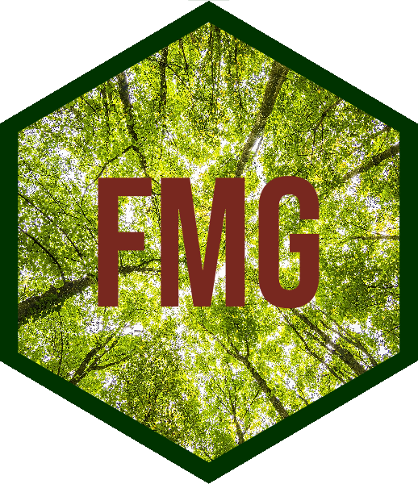
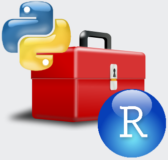

# FMG-StandWalk 
An ArcGIS toolbox that creates Forest Management Geodatabase (FMG) Stand Walk Reports. 

## Project Status

## Description

The FMG Stand Walk ArcGIS toolbox is a Python/R toolbox used to automate the production of the reports needed by foresters to conduct the "Stand Walk Recon" task. The purpose of a Stand Walk Recon is to assess the current condition of a given forest stand using the forest survey data recorded in the FMG, and from this information, to develop a "Stand Prescription" that will define its management in the coming years. 

The "Stand Walk Recon" task is composed of two elements:

* **Stand Summary** - A sheet summarizing the FMG field survey data for a given stand. Foresters need to consult the summary statistics on this sheet to help record decisions on the next sheet. 
* **Stand Prescription** - A sheet used by a forester to record their assessment of what management actions should be taken for a given stand. 

## Funding
Funding for the development and maintenance of the Forest Management Geodatabase (FMG) has been provided by USACE Rock Island District, Operations Division, Mississippi River Project, Natural Resources. 

## Latest Updates
Check out the [NEWS](NEWS.md) for details on the latest updates. 

## Authors
* [Michael Dougherty](mailto:Michael.P.Dougherty@usace.army.mil), Geographer, Rock Island District, U.S. Army Corps of Engineers
* [Christopher Hawes](mailto:Christopher.C.Hawes@usace.army.mil), Geographer, Rock Island District, U.S. Army Corps of Engineers
* [Ben Vandermyde](mailto:Benjamin.J.Vandermyde@usace.army.mil), Forester, Rock Island District, U.S. Army Corps of Engineers
* [Lauren McNeal](mailto:Lauren.J.McNeal@usace.army.mil), Forester, Rock Island District, U.S. Army Corps of Engineers

## Preview Reports
Use this link to preview the stand reports for the Mississippi River Pool 21 Pecan Grove test data:
[https://forestmanagementgeodatabase.github.io/FMG-StandWalk/index.html](https://forestmanagementgeodatabase.github.io/FMG-StandWalk/index.html). You can reproduce these reports following the instructions in the Getting Started section below. 

## Design
This [ArcGIS toolbox](https://pro.arcgis.com/en/pro-app/help/analysis/geoprocessing/basics/use-a-custom-geoprocessing-tool.htm) contains a set of [`R`](https://cran.r-project.org/) scripts that import a set of standard FMG geospatial datasets and produce a set of forest stand summary reports. These reports are built using [R Markdown](https://rmarkdown.rstudio.com/), that is introduced [here](https://rmarkdown.rstudio.com/developer_parameterized_reports.html%23parameter_types%2F) and described in detail [here](https://bookdown.org/yihui/rmarkdown/parameterized-reports.html). This approach makes available the advanced data science and reporting capabilities of `R` within USACE's enterprise GIS software, ArcGIS Pro and ArcMap. 

## Install
Use the following instructions to start running the reports. This toolbox requires the user to install `R`, `RStudio`, `ArcGIS Pro`, and optionally, `ArcMap`.

### Install `R`
`R` is a statistical computing environment required to perform calculations and report generation. 
* Ensure that `R` is installed. 
* `R` version 3.6.3 or greater is recommended. 

### Install `RStudio`
`Rstudio` is an Integrated Development Environment (IDE) for `R` that streamlines development and troubleshooting. 
* Ensure that `Rstudio` is installed.
* `RStudio` version 1.2.5033 or greater is recommended. 

### Install `ArcGIS Pro`
`ArcGIS Pro` is the GIS environment where the FMG data will be developed and the toolbox will be run from. 
* Ensure that `ArcGIS Pro` is installed. 
* `ArcGIS Pro` version 2.5 or greater is recommended. 

### Download the `arcgisbinding` package
The `arcgisbinding` `R` package allows `ArcGIS Pro` and `ArcMap` to read and write to R. Installing it through `ArcGIS Pro` also enables it for use in `ArcMap` as well. *Note: The ArcGIS R-bridge does not yet support R 4.0 for use in ArcGIS Pro or ArcMap geoprocessing tools.* See the [NEWS](NEWS.md) for more details on version compatibility. Please manually download the specified version using these instructions. 

* Navigate to the following URL: [https://github.com/R-ArcGIS/r-bridge](https://github.com/R-ArcGIS/r-bridge)
* In the "Releases" section on the middle-right side of the page, click the "+ xx releases" link. 
* Download the `v1.0.1.239` version. This file is named:  `arcgisbinding_1.0.1.239.zip`
* Note the location of the file you just downloaded. We will use it in a following step.

### Install the `arcgisbinding` package
The `arcgisbinding` `R` package is developed and maintained by ESRI to support the import and export of GIS data into `R`. 

* In `ArcGIS Pro`, on the top menu, click "Project", and click "Options" on the left menu.
* In the "Options" dialog box, click "Geoprocessing" on the left menu. 
* On the "Geoprocessing" page, scroll down to the "R-ArcGIS Support" section.
* In the "R-ArcGIS Support" section, verify the installed `R` version for ArcGIS to use.
* Select an `R` version in the 3.6.x series.  
* Below the "Detected R home directories" drop-down menu, you will see the `arcgisbinding` package section. From the drop-down, choose the "Update from file" option. Navigate to the `arcgisbinding_1.0.1.239.zip` file you downloaded in an earlier step and click the OK button. 

### Download the toolbox
The code in the FMG-StandWalk repository contains all of the files needed to use this ArcGIS toolbox. 

* In the "Releases" section above on the right side of the page, click the green "latest" link. 
* On the latest release page, use the "Source code (zip)" link to download a ZIP archive of the toolbox. 
* Unzip the archive to your project folder. 
* In `ArcMap` or `ArcGIS Pro`, navigate to the folder where you just unzipped the archive and you are ready to use the `StandWalk` ArcGIS toolbox. 

## Getting Started
Open either ESRI ArcGIS Pro or ArcMap. Navigate to the folder where you unzipped the `FMG-StandWalk` zip file and open the `StandWalk.tbx` ArcGIS toolbox. 

### Running the Stand Walk Reports
Follow the standard FMG instructions for collecting FMG field data, QA/QC the data, and summarize the data. These steps must be completed first to prepare the data to produce the Stand Walk reports. 

* Open the `Stand Walk Summary` tool. 
* Add the "stand" polygon feature class (either FMG `Site` or `Stand` level polygons) used to summarize plot data to the tool. 
* Add the FMG plot point feature classes to the tool. 
* Add the FMG summary tables to the tool.
* Run the tool. The reports will be written to the parent folder of the geodatabase used for the input FMG data. 

### Test Data
The functionality of this toolbox can be tested using the data provided in the `FMG_StandWalk/test` folder. In the test folder you will find a series of projects where the FMG forestry surveys have been conducted. These geodatabases contain the QA'd data necessary to produce a Stand Walk Summary report. 